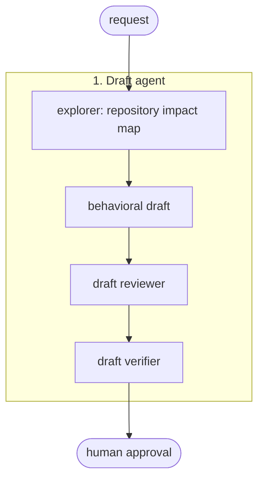
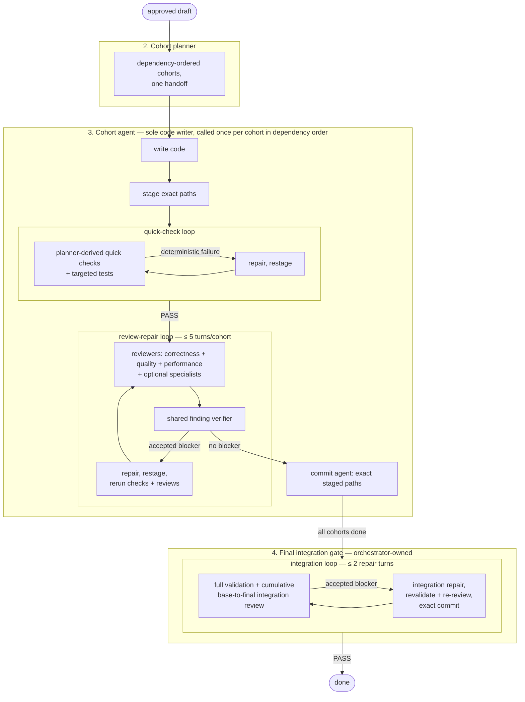

# Architecture and rationale

Configuration is built on five principles:

- selected context,
- one owner per decision,
- deterministic evidence,
- bounded review,
- exact commit boundaries.

[README][readme] covers commands; [Iterate guide][iterate-guide] covers instruction edits.

## Architecture

Draft:



Implementation:



Ownership is split cleanly:

- Approved draft owns behavior.
- [Implementation orchestrator][implement] creates cohorts, calls [cohort agent][cohort] exactly once per cohort, and owns the final gate.
- Cohort agent owns writing, checks, review, repair, and commit.

This keeps local failures in one context while reviewers remain read-only and independent.

## 1. Draft

[Draft explorer][draft-explorer] builds impact map from repository evidence. Like all agents here, it selects context instead of loading everything:

- begin from requested behavior and exact targets;
- map direct producers and consumers;
- inspect one dependency hop;
- expand only when a call, import, schema, manifest, migration, test, trace, or trust-boundary clue can change decision;
- pass paths and evidence references instead of copied repositories or transcripts.

This aims to improve relevant context density:

- [Repoformer][repoformer] reports that selective retrieval brought “as much as 70% inference speedup ... without harming the performance” on repository-level completion benchmarks.[^repoformer-scope]
- [Lost in the Middle][lost-middle] found performance “significantly degrades” when relevant information sits in middle of long contexts.
- [CodeRabbit path instructions][coderabbit-paths] similarly document that excluding irrelevant files “keeps reviews focused and fast.”

These sources motivate selective context in general; the specific one-dependency-hop rule above is this repository's own design choice, not something these sources prescribe.

Draft review is a bounded `draft reviewer -> verifier -> human approval` flow.

- The read-only [draft verifier][draft-review-verifier] runs only when the reviewer reports findings; it is skipped when there are none.
- The reviewer report is a candidate rather than authority; the verifier refutes candidates against the request, draft, explorer discovery, and repository evidence.
- The verifier only promotes or rejects reviewer candidates; it promotes only evidence-backed required corrections and never becomes a second planner.
- A verifier rejection leaves the draft unchanged; unavailable evidence or a required human decision stops safely.
- Human approval is required before implementation starts.

## 2. Cohort planning

[Cohort planner][create-cohorts] converts approved draft into an implementation handoff:

- groups source, tests, and required documentation by observable outcome;
- orders groups by repository dependency;
- routes correctness, quality, and performance always for runtime-code cohorts; routes tests or security only for concrete risk;
- marks cross-cohort risk for the final gate;
- derives full validation commands from manifests, task runners, CI, and developer docs — never invented.

This mirrors [CodeRabbit's Change Stack][coderabbit-change-stack], which groups related files into "cohorts" by dependency — applied here to planning instead of review.

## 3. Cohort loop

[Cohort agent][cohort] is the sole code writer and loop owner for one cohort. It calls reviewers, the shared verifier, and the commit agent; it never runs another writer.

### Write and stage (cohort agent)

The cohort agent works on exact proposed commit:

- guards against dirty targets — already-changed planned target is ambiguous ownership and returns `NEEDS_INPUT`;
- implements smallest cohesive diff for the cohort's outcome;
- stages only cohort paths in real Git index.

### Quick checks: deterministic evidence first (cohort agent)

Before semantic review, the cohort agent runs quick validation commands derived by the planner from manifests, task runners, CI, and developer docs, then applicable targeted tests. Executed product failures are repaired and rerun; unavailable tools, services, credentials, or fixtures produce `INCOMPLETE`.

Execution evidence includes:

- command,
- working directory,
- result,
- exit code,
- decisive output.

It does not manufacture screenshots or logs. [Greptile's TREX article][greptile-trex] states, “Bad evidence is worse than no evidence,” and backs findings with scripts, logs, traces, and screenshots in disposable sandboxes. This configuration has no disposable sandbox, so it runs only authorized repository-native checks and reports unavailable proof as `INCOMPLETE`.

### Review (read-only reviewer agents)

The cohort agent calls reviewers only after quick checks pass:

- correctness and quality always review exact proposed commit;
- [tests][optional-reviews] and [security][optional-security] reviewers run only when routed or matching concrete risk; the [performance][optional-performance] reviewer runs on every runtime-code commit and again at the final gate;
- reviewers inspect staged diff independently and remain read-only.

Reviewers inspect code and repository evidence rather than trusting surrounding prose. Plans define approved intent; PR text, comments, summaries, and tool narration remain claims to check.

[Review-finding rules][review-findings] require, for every internal candidate finding:

- violated contract,
- exact location,
- reachable failure path,
- material impact,
- falsifiable verification.

Severity, confidence, reviewer count, and repetition are metadata—not proof.

Signal budget also matters. [Greptile reports][greptile-filtering] its own comments were 19% useful, 2% incorrect, and 79% nits; team-feedback filtering raised reported address rate from 19% to 55%+ in two weeks.[^greptile-vendor] Local reviewers cap low-value output; only findings with material impact become blocking.

### Verify and repair (shared verifier + cohort agent)

Reviewer findings are often false positives, so no finding is trusted directly. Every candidate finding goes to a [shared verifier][review-verifier], which tries to refute it against the actual code before it can block anything.

Once a finding survives verification, repair stays with the cohort agent:

- accepted blockers and accepted advisories enter repair; the cohort has at most five repair turns total, shared between quick-check failures and verified review findings;
- advisories are repaired only within approved plan scope; one that cannot be fixed without widening scope stays recorded and is not a FAIL;
- after repair, the cohort restages, reruns all quick checks, core reviews, and affected optional reviews, then re-verifies the new findings;
- every selected reviewer must complete before commit.

This is why verification matters: [Refute-or-Promote][refute-promote], a pipeline built to filter LLM reviewers' persistent false positives, reports killing about 79% of roughly 171 candidate findings before disclosure. In its clearest failure, ten dedicated reviewers unanimously endorsed a nonexistent vulnerability that a single empirical test rejected.[^refute-preprint] Refutation and deterministic evidence beat reviewer agreement — though this remains single-operator 2026 preprint evidence, not controlled proof of this workflow.

### Commit (commit agent)

[Commit agent][commit-agent] commits only approved staged paths while preserving unrelated staged and unstaged changes. Orchestrator then moves to next cohort in dependency order.

## 4. Final integration gate

After all cohorts commit, the [implementation orchestrator][implement] owns the gate: it runs full validation and reviews cumulative base-to-final implementation. A final repair has two identities:

- cumulative base-to-final diff for integration review;
- staged repair diff for correctness, quality, and commit.

Integration repair is bounded to two turns; each turn revalidates, re-reviews, and commits exact repair paths.

This matters because separately valid changes can compose badly, which per-cohort review cannot see; only the cumulative base-to-final diff shows the composition.

## Git boundaries

Implementation assumes it is the only writer in the repository:

- if a planned target file is already dirty, it stops — someone else may own those edits;
- it stages, reviews, and commits only the paths it changed, by explicit path;
- everything else — your unrelated staged or unstaged work — is left untouched and verified unchanged afterward.

Only implementation commits automatically. Documentation and refactor workflows just edit files in place, so running them again on already-modified files is fine.

## CodeRabbit

The local review loop is roughly based on CodeRabbit's concepts — scoped diff, repair of blocking findings, revalidation, re-review. [CodeRabbit's path instructions][coderabbit-paths] follow the same philosophy as local rules: targeted instructions “work best as a targeted supplement, not a replacement.”

CodeRabbit itself can also be invoked directly via `/review/coderabbit`, which runs the official [CodeRabbit CLI][coderabbit-cli]. As an external review authority, its findings skip the local verifier.

## Instruction authoring and iterate

[Instruction standard][instruction-standard] chooses smallest mechanism:

| Need | Mechanism |
|---|---|
| User entry point | Thin command routing `$ARGUMENTS` to one owner. |
| Distinct privilege, context, or independent judgment | Agent. |
| Reusable on-demand guidance | Skill. |
| Shared runtime policy | Rule group. |
| Mechanical invariant | Existing script, test, or direct check. |
| Usage and rationale | Human documentation. |

Runtime prompts:

- state trigger, objective, inputs, authority, decisions, stop conditions, evidence, failure behavior, and exact output;
- pass paths rather than pasted context;
- use `[[placeholder]]`;
- request evidence instead of private reasoning transcripts.

`/iterate/edit` uses one compact flow:

```text
contract -> one editor -> exact staging -> validator/tests
         -> focused reviewer -> verifier -> at most two repairs
```

[Iterate orchestrator][iterate-agent] runs validator and workflow tests for self-edits and requests architecture/adversarial review when contract requires those lenses.

## Design boundaries

- Context expands from concrete dependency evidence rather than exhaustive graph or embedding retrieval. [Repoformer][repoformer] and [Lost in the Middle][lost-middle] motivate selectivity; they do not prescribe local thresholds.
- No learned reviewer memory feeds automatic decisions. [Greptile's reported feedback-clustering gain][greptile-filtering] depends on team votes; this configuration has no governed feedback corpus.[^greptile-vendor]
- No fixed context percentage, reviewer vote, or finding quota determines correctness. [Refute-or-Promote's][refute-promote] unanimous false positive shows why agreement alone is weak evidence.[^refute-preprint]
- Advisories enter automatic repair only when verifier-vetted and fixable within approved plan scope. [Greptile's reported 79% nit share][greptile-filtering] illustrates cost of treating every comment as action.[^greptile-vendor]
- Repair loops are bounded: five turns per cohort, two at final integration, two in iterate, and one CodeRabbit re-review.
- Runtime execution stays within available repository environment. [Greptile describes][greptile-trex] each TREX review using “a disposable sandboxed environment”; local workflow does not claim equivalent isolation.
- Implementation uses real Git index and one-writer assumption. Each invocation starts from approved draft and creates fresh evidence artifacts.

## Validation

[Configuration validator][validator] documents its checks in its module docstring and checks:

- parseability, frontmatter, routes, reachability;
- task depth, permissions, imports, rule reachability;
- Markdown structure, local documentation links;
- Python/shell syntax, required global options.

[Workflow tests][workflow-tests] cover implementation-specific contracts.
[Draft workflow tests][draft-workflow-tests] deterministically cover the draft reviewer-verifier route, permissions, handoff, correction gate, and documentation claims.

[^repoformer-scope]: Repoformer evaluates repository-level code completion, not issue-resolution workflow.
[^refute-preprint]: Refute-or-Promote is arXiv preprint and retrospective field study; authors report no autonomous vulnerability discovery and no component ablation.
[^greptile-vendor]: Greptile numbers are vendor-reported internal metrics, not independent evaluation.

[readme]: README.md
[iterate-guide]: .opencode/ITERATE.md
[implement]: config/agent/_implement.md
[cohort]: config/agent/_implement/cohort.md
[optional-reviews]: config/agent/_implement/cohort/review/optional/tests.md
[optional-security]: config/agent/_implement/cohort/review/optional/security.md
[optional-performance]: config/agent/_implement/cohort/review/optional/performance.md
[review-verifier]: config/agent/_review/verifier.md
[commit-agent]: config/agent/commit.md
[draft-explorer]: config/agent/_plan/draft/explorer.md
[draft-review-verifier]: config/agent/_plan/draft/verifier.md
[create-cohorts]: config/agent/_implement/create-cohorts.md
[review-findings]: config/rules/groups/implementation/review-findings.md
[instruction-standard]: .opencode/rules/instruction-authoring.md
[iterate-agent]: .opencode/agent/_iterate/edit.md
[validator]: scripts/validate-opencode-config.py
[workflow-tests]: tests/test_implement_workflow.py
[draft-workflow-tests]: tests/test_draft_workflow.py
[repoformer]: https://proceedings.mlr.press/v235/wu24a.html
[lost-middle]: https://aclanthology.org/2024.tacl-1.9/
[refute-promote]: https://arxiv.org/abs/2604.19049
[greptile-filtering]: https://www.greptile.com/blog/make-llms-shut-up
[greptile-trex]: https://www.greptile.com/blog/trex-code-execution
[coderabbit-cli]: https://docs.coderabbit.ai/cli/reference
[coderabbit-paths]: https://docs.coderabbit.ai/configuration/path-instructions
[coderabbit-change-stack]: https://docs.coderabbit.ai/pr-reviews/coderabbit-review
