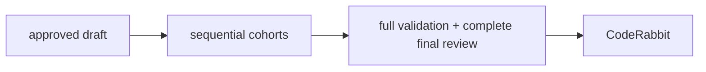
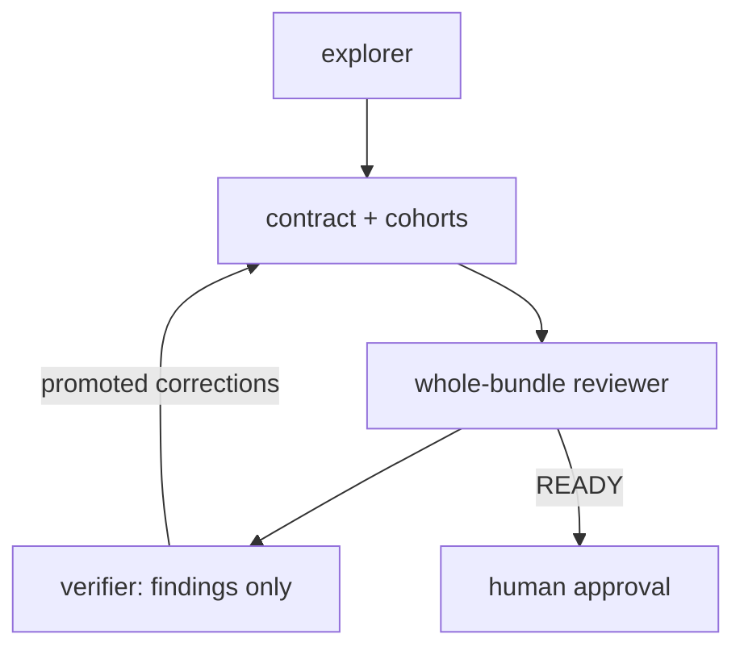

# Architecture and rationale

- Use selected context, one decision owner, checks, and bounded review.
- [README] covers usage; the [Iterate guide] covers instruction edits.

## Architecture

- The approved draft owns behavior and cohort decomposition.
- The [implementation parent] dispatches cohorts and owns final integration.
- Each [cohort agent] owns writing, checks, review/repair, and delegated commit.
- Reviewers are read-only and independent, with role-scoped tools and context.



## Draft and approval

- The [explorer] alone gathers product evidence, starting with dependencies.
- Discovery expands only on evidence that can change a decision.
- The draft parent reads its bundle and checks paths/ignore protection.
- External research needs a third-party contract question or user request.
- External facts retain version and source provenance.

- `PROMPT-PLAN-[[slug]].draft.md` is the entry point and ordered cohort index.
- It links `artifact/plan/[[plan]]/contract.md` and cohorts like `01-models.md`.
- `[[plan]]` is the root basename without `.draft.md`.
- The contract holds shared decisions and acceptance ownership once.
- Cohorts start with Goal, Scope, Not in Scope, and Done when.
- Grounded technical context, tests/docs, commands, and review routes follow.
- Prefer small testable variants: ZIP, then 7z, then RAR.
- The root owns full-validation commands and final routes.
- Partial milestones do not mean full completion.

- The [plan-bundle rule] owns path, membership, read, and trust boundaries.

- Plans stay untracked and ignored using exact local excludes if needed.
- Worktree-safe checks stop unprotected writes without changing `.gitignore`.

The whole-bundle flow is `draft reviewer -> verifier -> human approval`:



- The read-only [draft verifier][draft-review-verifier] runs only for findings.
- It promotes evidence-backed required corrections, not a second plan.
- A verifier rejection leaves the draft unchanged, not ready.
- Missing evidence or decisions stop safely; malformed output fails closed.
- Review has two passes; the latest must be ready for `READY_FOR_IMPLEMENT`.
- `/implement` approves the whole plan, not individual tasks.

## Implementation ownership

- The parent reads root plan content, member metadata, and runtime evidence.
- It validates routing and dispatches authored cohorts in dependency order.
- Writers/cohort reviewers read the contract, assigned cohort, and references.
- Final reviewers read full acceptance and cross-cohort authority.
- Repair and finding verification read authority relevant to supplied issues.
- Standalone work retains its separate handoff.

- Implementation never edits plans or silently changes approved boundaries.
- Missing structure or changed decisions needs `/draft` and renewed approval.
- Only evidence-backed mechanical drift may be reconciled locally.
- Successful cohorts advance without approval pauses.

### Resume

- “Resume from C03” continues unfinished work using the original run/base.
- Repair/CodeRabbit budgets persist; partial work gets fresh checks/reviews.
- Unclear ownership needs input; no checkpoints or discarded prior work.

### Checks, review, and repair

- One cohort writer runs lint, scoped staging, quick checks, and targeted tests.
- Checks precede semantic review and use the authorized repository environment.
- Proven failures go to repair; missing required evidence is `INCOMPLETE`.
- Evidence records commands, cwd, results, exit codes, and decisive output.

- Correctness and quality independently inspect every proposed commit.
- Performance reviews runtime-code commits and final integration.
- Docs-only work records a performance skip reason.
- Test/security reviews need routing or concrete risk.
- Every selected reviewer must finish and inspect actual diffs and evidence.

- [Finding rules] require falsifiable evidence of a material contract violation.
- The [shared verifier] refutes candidates before they can trigger repair.
- Accepted blockers/advisories enter repair only within approved scope.
- Wider-scope advisories remain recorded, not failures.
- Repair repeats checks, core/affected reviews, and findings verification.

- Cohort/one-shot repair defaults to five turns for checks and verified issues.
- Each resolves a positive user limit or explicit no limit as `unlimited`.
- Malformed or conflicting limits need input.
- Final integration and iterate allow two repair turns.
- Bounded failures report consumed turns and the limit.
- Remaining blockers are `FAIL`; missing required evidence is `INCOMPLETE`.

### Final gate and Git boundaries

- After cohort commits, full validation/review checks cumulative interactions.
- Final repairs get integration review plus staged correctness/quality review.
- Each repair is revalidated, re-reviewed, and committed by exact path.

- The [commit agent] preserves unrelated staged and unstaged work.
- Implementation never pushes, resets, or amends.
- Documentation/refactor workflows do not automatically commit.

## CodeRabbit and standalone work

- `/review/coderabbit` uses the official [CodeRabbit CLI].
- Its external findings bypass the local verifier.
- Implementation and [one-shot] call it after integration, as last code writer.
- There is one CodeRabbit self-fix pass with one re-review.
- Its edits re-enter checks, staged review, verification, and scoped commit.
- An unavailable external service remains `INCOMPLETE` after local commits.

- [Code] uses the session model and shared writing rules interactively.
- Reviews need an explicit request; commits remain user-initiated.
- Pipeline agents pin `sewer-axonhub/glm-5.3` and may share blind spots.
- Cross-model review is unexercised.

## Instruction authoring and iterate

- The [instruction standard] prefers one owner and the smallest mechanism.
- Use the minimum instruction that changes behavior, omitting inferable rules.
- Prefer human-first scope, small tasks, and tests for mechanics, not phrases.
- Scripts enforce mechanics; docs explain usage without runtime context cost.

The [iterate parent] runs:

```text
contract -> one editor -> exact staging -> validator/tests
         -> focused reviewer -> verifier -> at most two repairs
```

- Self-edits require config validation and workflow tests.
- Contracts route architecture/adversarial review when needed.

## Validation

- The [validator] documents its mechanical checks in its module docstring.
- [Implementation tests] and [Draft tests] cover workflow contracts.
- [Plan-bundle tests] exercise links and Git ignore/worktree mechanics.
- Static checks and scenario review are not live model or usability tests.
- Credentials, plugins, runtime, and services still require environment checks.

[draft-review-verifier]: config/agent/_plan/draft/verifier.md
[README]: README.md
[Iterate guide]: .opencode/ITERATE.md
[implementation parent]: config/agent/_implement.md
[cohort agent]: config/agent/_implement/cohort.md
[explorer]: config/agent/_plan/draft/explorer.md
[plan-bundle rule]: config/rules/cards/structure/plan-bundle.md
[Finding rules]: config/rules/groups/implementation/review-findings.md
[shared verifier]: config/agent/_review/verifier.md
[commit agent]: config/agent/commit.md
[CodeRabbit CLI]: https://docs.coderabbit.ai/cli/reference
[one-shot]: config/agent/_implement/one-shot.md
[Code]: config/agent/code.md
[instruction standard]: .opencode/rules/instruction-authoring.md
[iterate parent]: .opencode/agent/_iterate/edit.md
[validator]: scripts/validate-opencode-config.py
[Implementation tests]: tests/test_implement_workflow.py
[Draft tests]: tests/test_draft_workflow.py
[Plan-bundle tests]: tests/test_plan_bundle.py
